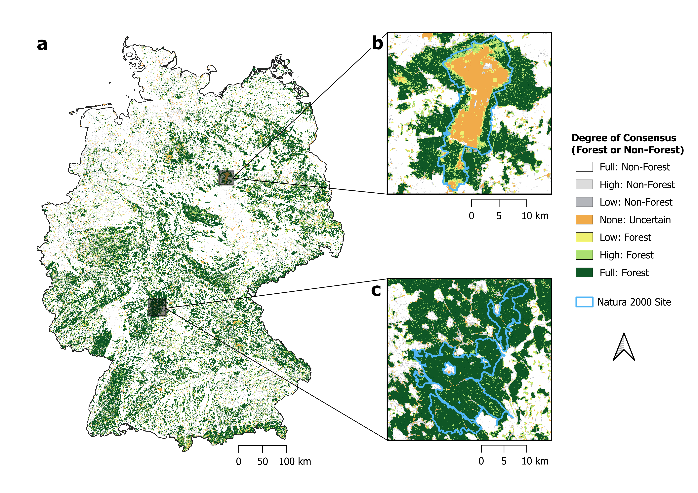
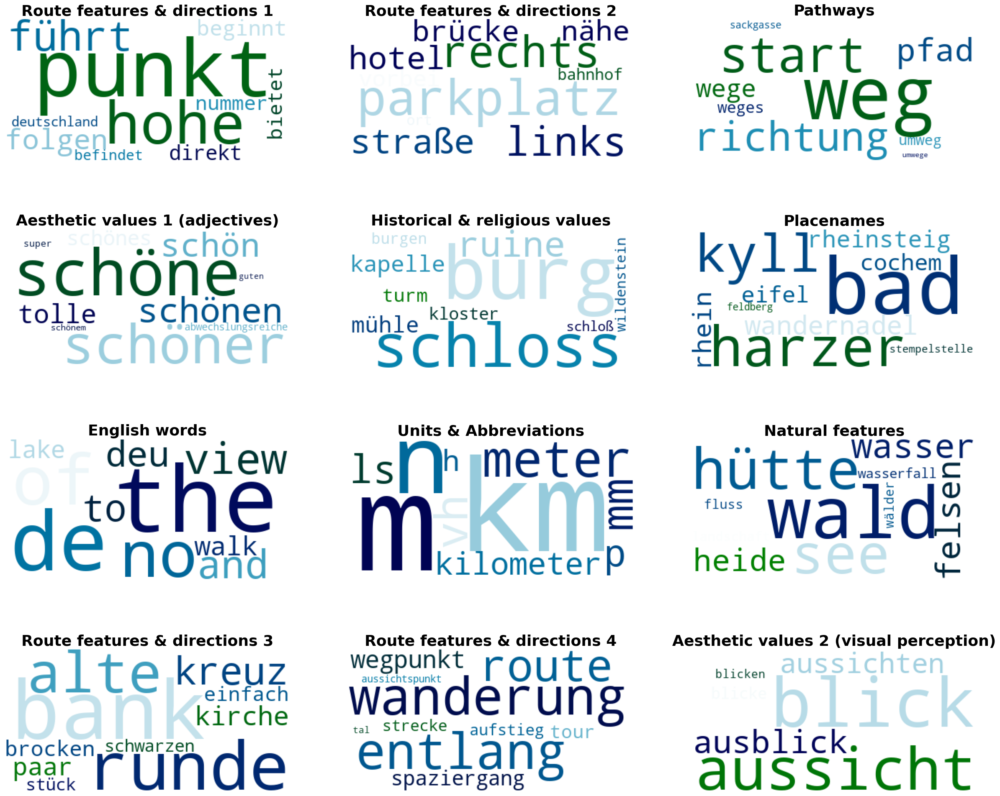
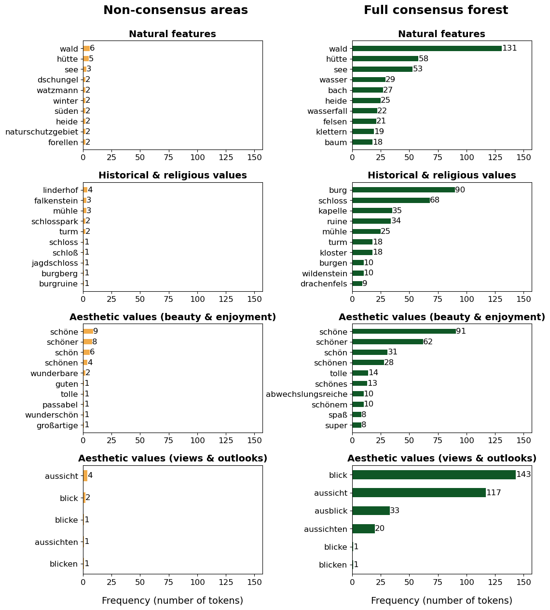

### Towards holistic forest monitoring in Europe: An exploration of forest definitions, cultural ecosystem services and their interactions in Germany’s Natura 2000 sites

This repository contains all the set-up information and scripts for my MSc thesis at the University of Zurich. The files are generally organised by my three research questions (RQs):

1)	**What is considered to be forest?** How do different forest definitions and their geospatial operationalisations change what is counted as forest in the Natura 2000 network in Germany? Where is there consensus on forest presence and where is there no consensus?
2)	**How do people value forests?** What cultural ecosystem services are experienced by people recreating in forests in the Natura 2000 network in Germany?
3)	**How does the way people value forest relate to forest definition?** Do the observed cultural ecosystem services change in areas where there is consensus on forest presence compared to areas where there is no consensus?

To answer these research questions I use a combination of geospatial analysis (RQ1) and natural language processing (RQ2/RQ3). I have documented the steps for each RQ alongside the code in the Juypter Notebook and R Markdown files. 

A preview of some of the outputs:

